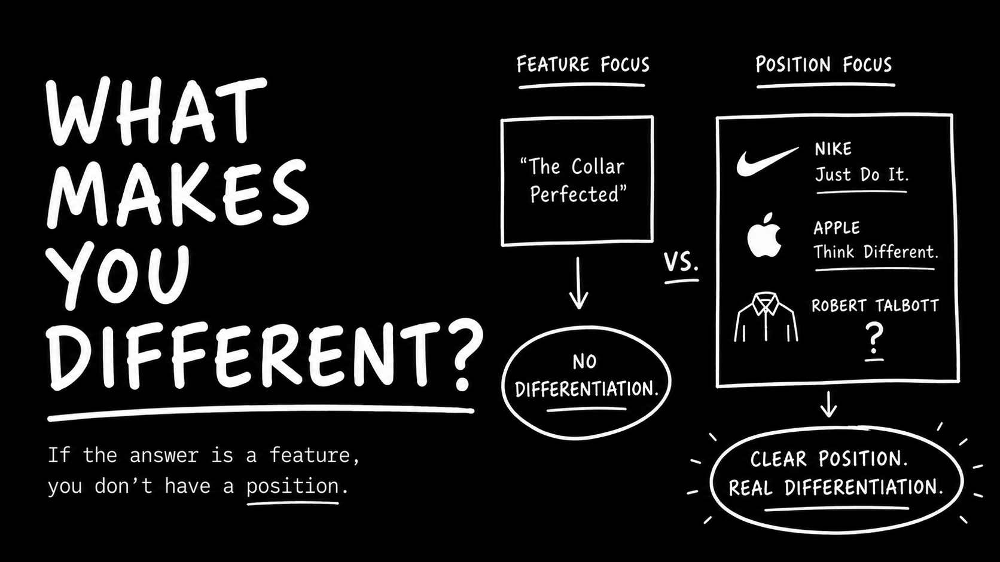

Written by Josh Paul Popkin. Published June 17, 2026.

I was riding the Metro-North from Connecticut back to New York today and came across a train ad that perfectly highlights a massive marketing mistake.

The ad was for a menswear brand called Robert Talbott, and the headline read: *"The Collar Perfected."*

Here’s why that fails: it focuses entirely on a product feature.

In advertising, customers don’t buy features; they buy positioning.

Think about the world's most iconic brands. Nike doesn't talk about stitching; they say, *"Just Do It."* Apple doesn't list tech specifications; they tell you to *"Think Different."* 

They build their entire narrative around a singular, powerful idea.

Claiming you have a "perfect collar" isn’t a positioning strategy.

You know who else claims to make a great collar? Every single menswear competitor on the market. It completely misses the mark on a unique value proposition.

As a consumer—and a highly qualified lead for premium menswear—I didn't want to know how they built the shirt. I wanted to know what makes their brand unique.

When you market your product, don’t just sell the feature.

**Sell the position.**
