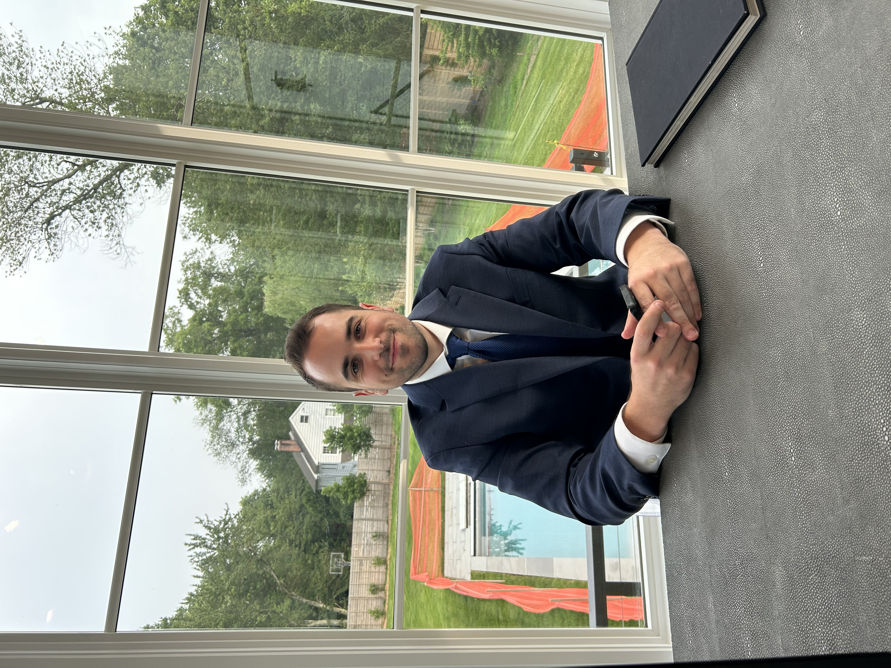

In under a month, Westport Family Homes increased how often it shows up in ChatGPT's answers about homebuilders by more than 7 percentage points — a clear example of the kind of measurable AI-visibility gain Position Strategy Group builds its work around. Using enterprise-grade tracking to monitor performance in the Homebuilding category on ChatGPT within the United States, Westport Family Homes' visibility climbed from 17.0% to 24.0% between mid-July and mid-August 2026, with citation coverage rising from 16.5% to 23.7% over the same period.

### What Actually Changed for Westport Family Homes?

Four numbers tell the core story. Visibility — how often the brand appears at all in relevant ChatGPT responses — rose from 17.0% to 24.0%, a gain of 7.1 percentage points. Share of voice, the brand's portion of all detected mentions in homebuilding-related answers, grew from 3.5% to 4.1%. Owned citation count rose from 35 to 51, and citation coverage — the share of measured responses where Westport Family Homes' own domain was cited as a source — climbed from 16.5% to 23.7%.

The standout result: Westport Family Homes held the **#1 rank for owned-domain citation share in every single weekly snapshot** across the entire measurement period — consistent category leadership from the very start of the engagement.

### Why Does This Matter More Than a Typical Marketing Metric?

Because these numbers measure something a standard analytics dashboard can't see: whether an AI system chooses to mention and cite a business at all when someone asks a related question. A prospective homebuyer in Connecticut asking ChatGPT about local builders never sees a results page to scroll through — they see whichever names the model decided to surface. Visibility and citation coverage are direct measurements of that selection process, not proxies for it. Moving those numbers means moving the actual thing that determines whether a business gets recommended.

### How Does Position Strategy Group Approach Work Like This?

PSG's general approach to AEO work runs in three stages, applied to every client engagement:

**Enterprise-grade data analysis.** Before touching a client's website or content, PSG establishes a real measurement baseline — tracking exactly how a brand currently appears (or doesn't) across ChatGPT, Gemini, Perplexity, and Google's AI Overviews, broken down by topic, region, and platform. For Westport Family Homes, that meant building out a structured prompt set across seven topic areas — from Connecticut home builders and luxury custom homes to energy-efficient design and direct competitor comparisons — so every future result can be measured against real data instead of guesswork.

**Strategy built around the actual gaps in the data.** Once PSG can see precisely where and why a brand is or isn't being surfaced, the firm builds a specific plan to close that gap — which topics to strengthen, which pages need to be restructured, where the brand's authority signals are thin relative to competitors already dominating a given query.

**Execution — building the actual assets designed to move the needle, and telling the real story behind the brand.** For Westport Family Homes specifically, that meant developing content that actually reflects the quality of their work — not generic homebuilder copy, but material grounded in what the team observed firsthand. As Josh Popkin put it: "Working with Westport Family Homes has shown how meticulous the team is with every aspect of the incredible houses they build. From the materials to the layouts to the design, to the custom aspects, it has been a great project to document all of the things that make clients love Westport Family Homes." That kind of specific, detailed content isn't just good storytelling — it's exactly the material an AI system needs to cite a brand accurately and favorably, instead of describing it in generic terms or not describing it at all.

This full loop — measure, strategize, build, remeasure — is the general framework behind PSG's AEO work, and Westport Family Homes' trajectory over its first month of tracking reflects the kind of movement that framework is built to produce.

### What Does a Result Like This Actually Demonstrate?

That AI visibility is measurable, trackable, and responsive — not a black box a business either shows up in or doesn't. In a matter of weeks, Westport Family Homes went from having no visibility program at all to leading its category in citation share and posting the strongest visibility reading of the entire tracking period. That's exactly the trajectory PSG aims for with every client: fast, real, measurable movement, built on a foundation that keeps compounding.

### Why Is Now the Time to Start With AEO?

Answer Engine Optimization (AEO) is the practice of making sure AI systems — ChatGPT, Gemini, Perplexity, Google's AI Overviews — actually name and cite a business when someone asks a relevant question. It's a different competition than traditional search: there's no page two, no list of ten links to scroll through. There's one synthesized answer, built from a small handful of sources the model decided were worth citing. A business that isn't structured to be one of them doesn't rank lower — it doesn't show up in that conversation at all.

The businesses moving on this now, the way Westport Family Homes has, are building a real head start. Categories are still being defined in AI systems' understanding of who the credible, citable authorities are — and results like a #1 citation-share ranking from week one show how quickly a business can establish that authority when the strategy and execution are done right. The businesses that wait are competing for the same ground later, against competitors who already own it.

### Frequently Asked Questions

**What is Answer Engine Optimization (AEO)?** The practice of structuring a business's website, data, and content so AI systems like ChatGPT, Gemini, and Perplexity name and cite it directly when answering relevant questions.

**How long did it take Westport Family Homes to see results?** The reported gains — including the visibility increase from 17.0% to 24.0% — occurred within roughly one month of tracking beginning.

**What platform was used to measure Westport Family Homes' results?** ChatGPT, within the United States region, across the Homebuilding category.

**Does a citation coverage increase mean more customers?** Not directly — citation coverage measures how often a brand's domain is cited as a source in AI-generated answers, which is a leading indicator of visibility rather than a direct revenue metric. It reflects how often a business is being surfaced as a trusted source, which is the necessary first step before a prospective customer ever reaches out.

**What does Position Strategy Group do for clients like Westport Family Homes?** PSG measures a brand's current visibility across AI platforms, builds a strategy to close the gaps in that data, and then executes — restructuring content and site data, and documenting the actual craftsmanship behind a client's work — before remeasuring to confirm what's working.
